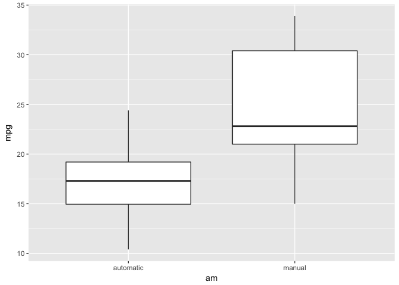
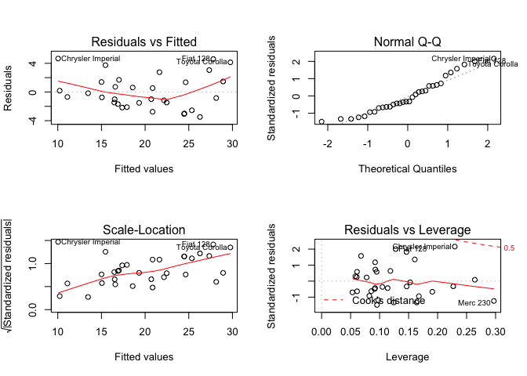

# Regression Project
Introduction:
You work for Motor Trend, a magazine about the automobile industry. Looking at a data set of a collection of cars, they are interested in exploring the relationship between a set of variables and miles per gallon (MPG) (outcome). They are particularly interested in the following two questions:
(1) Is an automatic or manual transmission better for MPG?
(2) Quantify the MPG difference between automatic and manual transmissions.
(3) Build a regression model between MPG and other variables.


Set up the packages and dataset:

```r
library(ggplot2)
data("mtcars")
```

Explore the data:

```r
help("mtcars")
str(mtcars)
```

```
## 'data.frame':	32 obs. of  11 variables:
##  $ mpg : num  21 21 22.8 21.4 18.7 18.1 14.3 24.4 22.8 19.2 ...
##  $ cyl : num  6 6 4 6 8 6 8 4 4 6 ...
##  $ disp: num  160 160 108 258 360 ...
##  $ hp  : num  110 110 93 110 175 105 245 62 95 123 ...
##  $ drat: num  3.9 3.9 3.85 3.08 3.15 2.76 3.21 3.69 3.92 3.92 ...
##  $ wt  : num  2.62 2.88 2.32 3.21 3.44 ...
##  $ qsec: num  16.5 17 18.6 19.4 17 ...
##  $ vs  : num  0 0 1 1 0 1 0 1 1 1 ...
##  $ am  : num  1 1 1 0 0 0 0 0 0 0 ...
##  $ gear: num  4 4 4 3 3 3 3 4 4 4 ...
##  $ carb: num  4 4 1 1 2 1 4 2 2 4 ...
```
All the variables are numeric, but since "am"(Transmission) is a categorical variables, it should be a factor variable, so I transfrom the "am" into factor.

```r
mtcars$am <- factor(mtcars$am, levels = c(0,1), labels = c("automatic","manual"))
str(mtcars$am)
```

```
##  Factor w/ 2 levels "automatic","manual": 2 2 2 1 1 1 1 1 1 1 ...
```

We can draw a boxplot to compare the MPG for manual and automatic transmission.

```r
ggplot(data = mtcars, aes(x=am, y=mpg))+
  geom_boxplot()
```

<!-- -->

Then, from the boxplot below, we can easily tell that the mpg of manual is higher than the mpg of automatic, but the conclusion needs statistical evidence.

```r
manual_mpg <- subset(mtcars, am=="manual")
automatic_mpg <- subset(mtcars, am=="automatic")
t.test(manual_mpg$mpg, automatic_mpg$mpg)
```

```
## 
## 	Welch Two Sample t-test
## 
## data:  manual_mpg$mpg and automatic_mpg$mpg
## t = 3.7671, df = 18.332, p-value = 0.001374
## alternative hypothesis: true difference in means is not equal to 0
## 95 percent confidence interval:
##   3.209684 11.280194
## sample estimates:
## mean of x mean of y 
##  24.39231  17.14737
```

Results of an one-sample t-test indicate that the mean for mean for MPG of manual transmission is significantly different than the mean for MPG of automatic transimission (t(18.332)=3.767, p<.01), the mean of MPG for manual is higher (M=24.392). The difference between these two groups are range from 3.210 to 11.280.

Then we use the stepwise regression to find a best model to predict the MPG:

```r
fit <- lm(mpg ~ ., data = mtcars)
step(fit, direction = "both", trace = 1)
```

```
## Start:  AIC=70.9
## mpg ~ cyl + disp + hp + drat + wt + qsec + vs + am + gear + carb
## 
##        Df Sum of Sq    RSS    AIC
## - cyl   1    0.0799 147.57 68.915
## - vs    1    0.1601 147.66 68.932
## - carb  1    0.4067 147.90 68.986
## - gear  1    1.3531 148.85 69.190
## - drat  1    1.6270 149.12 69.249
## - disp  1    3.9167 151.41 69.736
## - hp    1    6.8399 154.33 70.348
## - qsec  1    8.8641 156.36 70.765
## <none>              147.49 70.898
## - am    1   10.5467 158.04 71.108
## - wt    1   27.0144 174.51 74.280
## 
## Step:  AIC=68.92
## mpg ~ disp + hp + drat + wt + qsec + vs + am + gear + carb
## 
##        Df Sum of Sq    RSS    AIC
## - vs    1    0.2685 147.84 66.973
## - carb  1    0.5201 148.09 67.028
## - gear  1    1.8211 149.40 67.308
## - drat  1    1.9826 149.56 67.342
## - disp  1    3.9009 151.47 67.750
## - hp    1    7.3632 154.94 68.473
## <none>              147.57 68.915
## - qsec  1   10.0933 157.67 69.032
## - am    1   11.8359 159.41 69.384
## + cyl   1    0.0799 147.49 70.898
## - wt    1   27.0280 174.60 72.297
## 
## Step:  AIC=66.97
## mpg ~ disp + hp + drat + wt + qsec + am + gear + carb
## 
##        Df Sum of Sq    RSS    AIC
## - carb  1    0.6855 148.53 65.121
## - gear  1    2.1437 149.99 65.434
## - drat  1    2.2139 150.06 65.449
## - disp  1    3.6467 151.49 65.753
## - hp    1    7.1060 154.95 66.475
## <none>              147.84 66.973
## - am    1   11.5694 159.41 67.384
## - qsec  1   15.6830 163.53 68.200
## + vs    1    0.2685 147.57 68.915
## + cyl   1    0.1883 147.66 68.932
## - wt    1   27.3799 175.22 70.410
## 
## Step:  AIC=65.12
## mpg ~ disp + hp + drat + wt + qsec + am + gear
## 
##        Df Sum of Sq    RSS    AIC
## - gear  1     1.565 150.09 63.457
## - drat  1     1.932 150.46 63.535
## <none>              148.53 65.121
## - disp  1    10.110 158.64 65.229
## - am    1    12.323 160.85 65.672
## - hp    1    14.826 163.35 66.166
## + carb  1     0.685 147.84 66.973
## + vs    1     0.434 148.09 67.028
## + cyl   1     0.414 148.11 67.032
## - qsec  1    26.408 174.94 68.358
## - wt    1    69.127 217.66 75.350
## 
## Step:  AIC=63.46
## mpg ~ disp + hp + drat + wt + qsec + am
## 
##        Df Sum of Sq    RSS    AIC
## - drat  1     3.345 153.44 62.162
## - disp  1     8.545 158.64 63.229
## <none>              150.09 63.457
## - hp    1    13.285 163.38 64.171
## + gear  1     1.565 148.53 65.121
## + cyl   1     1.003 149.09 65.242
## + vs    1     0.645 149.45 65.319
## + carb  1     0.107 149.99 65.434
## - am    1    20.036 170.13 65.466
## - qsec  1    25.574 175.67 66.491
## - wt    1    67.572 217.66 73.351
## 
## Step:  AIC=62.16
## mpg ~ disp + hp + wt + qsec + am
## 
##        Df Sum of Sq    RSS    AIC
## - disp  1     6.629 160.07 61.515
## <none>              153.44 62.162
## - hp    1    12.572 166.01 62.682
## + drat  1     3.345 150.09 63.457
## + gear  1     2.977 150.46 63.535
## + cyl   1     2.447 150.99 63.648
## + vs    1     1.121 152.32 63.927
## + carb  1     0.011 153.43 64.160
## - qsec  1    26.470 179.91 65.255
## - am    1    32.198 185.63 66.258
## - wt    1    69.043 222.48 72.051
## 
## Step:  AIC=61.52
## mpg ~ hp + wt + qsec + am
## 
##        Df Sum of Sq    RSS    AIC
## - hp    1     9.219 169.29 61.307
## <none>              160.07 61.515
## + disp  1     6.629 153.44 62.162
## + carb  1     3.227 156.84 62.864
## + drat  1     1.428 158.64 63.229
## - qsec  1    20.225 180.29 63.323
## + cyl   1     0.249 159.82 63.465
## + vs    1     0.249 159.82 63.466
## + gear  1     0.171 159.90 63.481
## - am    1    25.993 186.06 64.331
## - wt    1    78.494 238.56 72.284
## 
## Step:  AIC=61.31
## mpg ~ wt + qsec + am
## 
##        Df Sum of Sq    RSS    AIC
## <none>              169.29 61.307
## + hp    1     9.219 160.07 61.515
## + carb  1     8.036 161.25 61.751
## + disp  1     3.276 166.01 62.682
## + cyl   1     1.501 167.78 63.022
## + drat  1     1.400 167.89 63.042
## + gear  1     0.123 169.16 63.284
## + vs    1     0.000 169.29 63.307
## - am    1    26.178 195.46 63.908
## - qsec  1   109.034 278.32 75.217
## - wt    1   183.347 352.63 82.790
```

```
## 
## Call:
## lm(formula = mpg ~ wt + qsec + am, data = mtcars)
## 
## Coefficients:
## (Intercept)           wt         qsec     ammanual  
##       9.618       -3.917        1.226        2.936
```

From the output we can tell that the most parsimous and explainable model is MPG serve as the outcome with wt(Weight), qsec(1/4 mile time) and am(transmission). Before illustrating the result, I'd like to check the assumptions of Regression:


```r
par(mfrow=c(2,2))
fit_final <- lm(mpg ~ wt + am + qsec, data = mtcars)
plot(fit_final)
```

<!-- -->

In the residual plot, the residuals are randomly distributed around the plot without showing a systematic pattern, which means there is no heterscedasticity. In the Normal Q-Q plot, the dots are distributed around the line with no obvious outliers, so the Normality asscumptions is satisfied. In the last plot (the lower right plot), there are no high influential outliers.


```r
summary(fit_final)
```

```
## 
## Call:
## lm(formula = mpg ~ wt + am + qsec, data = mtcars)
## 
## Residuals:
##     Min      1Q  Median      3Q     Max 
## -3.4811 -1.5555 -0.7257  1.4110  4.6610 
## 
## Coefficients:
##             Estimate Std. Error t value Pr(>|t|)    
## (Intercept)   9.6178     6.9596   1.382 0.177915    
## wt           -3.9165     0.7112  -5.507 6.95e-06 ***
## ammanual      2.9358     1.4109   2.081 0.046716 *  
## qsec          1.2259     0.2887   4.247 0.000216 ***
## ---
## Signif. codes:  0 '***' 0.001 '**' 0.01 '*' 0.05 '.' 0.1 ' ' 1
## 
## Residual standard error: 2.459 on 28 degrees of freedom
## Multiple R-squared:  0.8497,	Adjusted R-squared:  0.8336 
## F-statistic: 52.75 on 3 and 28 DF,  p-value: 1.21e-11
```

The output indicate that all the three predictors are statistically significant and there account for 85% of the outcome variance. However, we also need to check the interaction between the those variables to interpret the result.


```r
fit_interaction <- lm(mpg ~ am:wt + am:qsec, data = mtcars)
summary(fit_interaction)
```

```
## 
## Call:
## lm(formula = mpg ~ am:wt + am:qsec, data = mtcars)
## 
## Residuals:
##     Min      1Q  Median      3Q     Max 
## -3.9361 -1.4017 -0.1551  1.2695  3.8862 
## 
## Coefficients:
##                  Estimate Std. Error t value Pr(>|t|)    
## (Intercept)       13.9692     5.7756   2.419  0.02259 *  
## amautomatic:wt    -3.1759     0.6362  -4.992 3.11e-05 ***
## ammanual:wt       -6.0992     0.9685  -6.297 9.70e-07 ***
## amautomatic:qsec   0.8338     0.2602   3.205  0.00346 ** 
## ammanual:qsec      1.4464     0.2692   5.373 1.12e-05 ***
## ---
## Signif. codes:  0 '***' 0.001 '**' 0.01 '*' 0.05 '.' 0.1 ' ' 1
## 
## Residual standard error: 2.097 on 27 degrees of freedom
## Multiple R-squared:  0.8946,	Adjusted R-squared:  0.879 
## F-statistic: 57.28 on 4 and 27 DF,  p-value: 8.424e-13
```

The interaction effects are all significant. The MPG will decrease 3.1759 gallen if the transmission is automatic and decrease 6.0992 gallen if the transimission is manual when holding the wt constant.


 -------------Conclusion:-----------

The automatic transmission is a significantly better than manual with respect to MPG, the condifence interval for the difference range 3.210 to 11.280. The model for predicting the MPG is that MPG is the outcome and wt, am and qsec included as the predictor.


